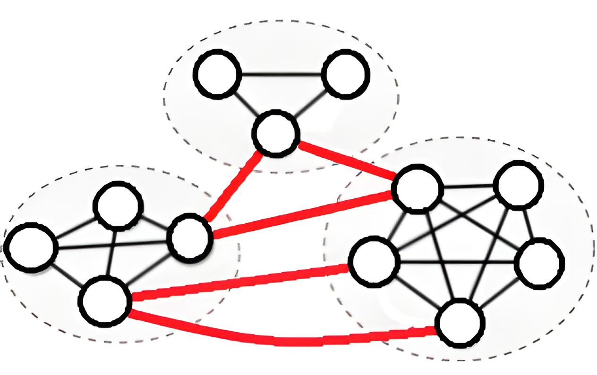

# Combinatorial Approximations for Cluster Deletion: Simpler, Faster, and Better

Code for the ICML 2024 paper, [***Combinatorial Approximations for Cluster Deletion: Simpler, Faster, and Better***](https://proceedings.mlr.press/v235/balmaseda24a.html)

[arXiv](https://doi.org/10.48550/arXiv.2404.16131)
[ICML 2024](https://icml.cc/virtual/2024/poster/34522)

---

Code for fast combinatorial methods to solve cluster deletion (DegMFP and RatMFP) and combinatorial solver for STC-LP (Strong Triadic Closure-Linear Programming relaxation).



**Table of Contents**
- [Code Organization](#code-organization)
  - [Experiments](#experiments)
  - [Methods](#methods)
  - [Data](#data)
- [Acknowledgements](#acknowledgements)
- [Cite](#cite)


## Code Organization

### Experiments

The experiments can be found in the `Experiments` folder.
`run-cd-functions.jl` contains the code to run a single instance of the cluster deletion problem with a given method.
The experiments are separated between `CD-experiments` and `merge-experiments`, with 

The `CD-experiments` folder contains the experiments for the cluster deletion problem.
- `run_many_main.jl` runs all the experiments from the paper
- `cd-table-print-results.jl` prints the results from the experiments in a table format and plots the figures
- `mpf-tests.jl` can be used to run the MFP methods faster

### Methods

You can find the implementations for the deterministic MFP methods (DegMFP and RatMFP) in `src/run_cd_functions.jl`.

The implementation for the combinatorial solver for STC-LP can be found in `src/cd_lp_minst_relaxations.jl`.

### Data

This repo contains some small toy graphs in the folder `data/smallgraphs`.

Most of the standardized graphs used in the experiments can be downloaded from [google drive](https://drive.google.com/file/d/15ytTbvT0Bd55GlBVehc1kI3_Qo59AEjD/view?usp=drive_link). These graphs are in the format needed to run the experiments.

Instead, the graphs used in the paper can be downloaded from [suitesparse.com](https://people.engr.tamu.edu/davis/suitesparse.html) and standardized using the `data/standardize-snap-graphs.jl` script.

## Acknowledgements

Our implementation is based on nveldt's repo [FastCC-via-STC](https://github.com/nveldt/FastCC-via-STC/tree/main).

## Cite

If you find our work helpful, please cite our paper:
```
@InProceedings{pmlr-v235-balmaseda24a,
  title = 	 {Combinatorial Approximations for Cluster Deletion: Simpler, Faster, and Better},
  author =       {Balmaseda, Vicente and Xu, Ying and Cao, Yixin and Veldt, Nate},
  booktitle = 	 {Proceedings of the 41st International Conference on Machine Learning},
  pages = 	 {2586--2606},
  year = 	 {2024},
  editor = 	 {Salakhutdinov, Ruslan and Kolter, Zico and Heller, Katherine and Weller, Adrian and Oliver, Nuria and Scarlett, Jonathan and Berkenkamp, Felix},
  volume = 	 {235},
  series = 	 {Proceedings of Machine Learning Research},
  month = 	 {21--27 Jul},
  publisher =    {PMLR},
  pdf = 	 {https://raw.githubusercontent.com/mlresearch/v235/main/assets/balmaseda24a/balmaseda24a.pdf},
  url = 	 {https://proceedings.mlr.press/v235/balmaseda24a.html},
}
```
